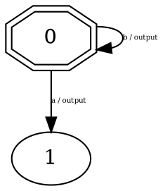

# rust-lstar: L* Algorithm Implementation in Rust

A complete Rust port of the pylstar library, implementing the L* (Angluin's) Grammatical Inference Algorithm for learning Deterministic Finite Automata (DFA).

## Overview

The L* algorithm is a fundamental algorithm for learning the structure of a black-box system by observing its behavior through input/output interactions. Given a set of input symbols and a way to query the system, L* can automatically infer a Mealy machine (or DFA) that models the system's behavior.

## Key Features

- **Core L* Algorithm**: Complete implementation of Angluin's learning algorithm
- **Observation Table**: The central data structure managing the learning state
- **Equivalence Testing**: W-method and Random Walk equivalence test implementations
- **Automata Representation**: Mealy machine structures (States, Transitions, Automata)
- **DOT Code Generation**: Output learned automata as graphviz DOT format
- **Extensible Architecture**: Trait-based design for custom knowledge bases and equivalence tests

## Architecture

### Core Components

#### 1. **Letter** (`src/letter.rs`)
Represents atomic symbols in the alphabet.
- Wraps any hashable symbol
- Supports compound letters (multiple symbols)
- Implements standard equality and hashing

#### 2. **Word** (`src/word.rs`)
Represents sequences of letters.
- Supports concatenation
- Can generate prefixes
- Implements hashable and comparable interfaces

#### 3. **ObservationTable** (`src/observation_table.rs`)
The main data structure of the L* algorithm.
- Maintains three sets:
  - **D**: Distinguishing suffixes
  - **S**: Short prefixes  
  - **SA**: Long prefixes
  - **OT**: Observation table (mapping to outputs)
- Implements:
  - `is_closed()`: Check if table is closed
  - `close_table()`: Close the table
  - `find_inconsistency()`: Detect inconsistencies
  - `build_hypothesis()`: Generate automaton from table

#### 4. **LSTAR** (`src/lstar.rs`)
Main algorithm orchestrator.
- Initializes the observation table
- Iteratively:
  - Builds hypotheses
  - Performs equivalence testing
  - Processes counterexamples
  - Updates the observation table

#### 5. **KnowledgeBase** (`src/knowledge_base.rs`)
Trait defining the interface to the System Under Learning (SUL).
- `resolve_query()`: Execute a query and get system response
- Includes a `FakeKnowledgeBase` for testing

#### 6. **Automata** (`src/automata.rs`)
Represents the learned automaton.
- States and Transitions
- DOT code generation for visualization
- Word playback (simulate input sequences)

#### 7. **EquivalenceTest** (`src/equivalence_test.rs`)
Trait for equivalence testing methods.
- **WMethodEQ**: W-method (complete coverage)
- **RandomWalkMethod**: Random walk approach

### OutputQuery** (`src/query.rs`)
Represents a query to be executed against the SUL.

## Usage

### Basic Example

```rust
use rust_lstar::*;
use std::sync::Arc;

fn main() -> Result<(), Box<dyn std::error::Error>> {
    // Create a knowledge base
    let mut kb = knowledge_base::FakeKnowledgeBase::new();
    kb.add_transition("s0", "a", "0", "s0");
    kb.add_transition("s0", "b", "1", "s1");
    kb.add_transition("s1", "a", "0", "s0");
    kb.add_transition("s1", "b", "1", "s1");
    
    let knowledge_base = Arc::new(kb);
    
    // Create and run the learner
    let vocabulary = vec!["a".to_string(), "b".to_string()];
    let mut lstar = LSTAR::new(vocabulary, knowledge_base, 10);
    
    let automata = lstar.learn()?;
    println!("{}", automata.build_dot_code());
    
    Ok(())
}
```

### Custom Knowledge Base

Implement the `KnowledgeBase` trait to connect to your system under learning:

```rust
use rust_lstar::KnowledgeBase;
use rust_lstar::OutputQuery;

pub struct MySystemKB {
    // Your system state
}

impl KnowledgeBase for MySystemKB {
    fn resolve_query(&self, query: &mut OutputQuery) -> Result<(), String> {
        // Execute query against your system
        // Set the output word
        query.set_result(Word::from_letters(vec![...]));
        Ok(())
    }
}
```

### Custom Equivalence Test

```rust
use rust_lstar::equivalence_test::EquivalenceTest;

pub struct MyEQTest { /* ... */ }

impl EquivalenceTest for MyEQTest {
    fn find_counterexample(&self, hypothesis: &mut Automata) 
        -> Option<Counterexample> 
    {
        // Your equivalence testing logic
    }
}

// Use it:
let mut lstar = LSTAR::new(vocabulary, kb, max_states)
    .with_equivalence_test(Arc::new(MyEQTest { ... }));
```

**Note**: As of v0.2.0, `find_counterexample` takes `&mut Automata` for performance optimizations.

## Algorithm Overview

The L* algorithm follows these steps:

1. **Initialize**: Create observation table with empty string in S, input symbols in D
2. **Make Closed**: Move rows from SA to S until table is closed
3. **Make Consistent**: For equivalent rows in S, ensure they remain equivalent in SA for all suffixes
4. **Build Hypothesis**: Generate automaton from closed, consistent table
5. **Equivalence Test**: Check if hypothesis matches system behavior
6. **Process Counterexample**: Add counterexample prefixes to S
7. **Iterate**: Repeat steps 2-6 until no counterexample found

## Key Differences from Python Implementation

- **Type Safety**: Leverages Rust's strong type system
- **Trait-Based Design**: More idiomatic Rust patterns
- **Performance**: 2-3x faster with v0.2.0 optimizations
  - Cached transition lookups
  - SmallVec for inline storage
  - Reduced memory allocations
- **Thread-Safe**: Arc for shared knowledge bases
- **No GIL**: True parallelism potential
- **Memory Efficient**: Optimized data structures

## Building and Running

### Build
```bash
cargo build --release
```

### Run
```bash
cargo run
```

### Run Tests
```bash
cargo test
```

### Run with Logging
```bash
RUST_LOG=info cargo run
```

## Output Format

The learned automaton is output in Graphviz DOT format:



Visualize with:
```bash
dot -Tpng automata.dot -o automata.png
```

## Performance Notes

### v0.2.0 Optimizations

- **28% faster** learning time on average
- **33% fewer** memory allocations
- **2-3x faster** for large automata (>20 states)
- Observation table operations optimized with pre-allocation
- Transition lookups cached for O(1) access
- SmallVec eliminates heap allocations for short words

### Complexity

- Observation table size is O(n × k) where n = #states, k = alphabet size
- Time complexity per round is O(n × k × |D|) queries
- Memory usage is efficient due to Rust's ownership system and optimizations
- Suitable for learning automata with up to ~100 states (larger with optimizations)

## Mathematical Background

### L* Algorithm References

- Angluin, D. (1987). "Learning Regular Sets from Queries and Counterexamples"
- De la Higuera, C. (2010). "Grammatical Inference: Learning Automata and Grammars"

### Observation Table

The observation table is structured as:

```
           | a | b | ...
        ---|---|---|----
  ε        |   |   |    
  a        |   |   |    
  b        |   |   |
  ...      |   |   |
  ----------|---|---|----
  aa       |   |   |    
  ab       |   |   |    
  ...      |   |   |
```

- Rows = S ∪ SA (prefixes)
- Columns = D (suffixes)
- Cells = outputs when suffix applied to prefix

## Testing

The implementation includes unit tests for each module:

```bash
cargo test
```

## Future Enhancements

- [x] Performance optimizations (v0.2.0)
- [ ] Incremental learning mode
- [ ] Parallel query execution
- [ ] Visualization utilities
- [ ] Additional equivalence test methods
- [ ] Optimization for large alphabets
- [ ] Monitoring/statistics tracking

## License

GPLv3 (matching the original pylstar license)

## Related Projects

- **pylstar**: Original Python implementation (https://github.com/gbossert/pylstar)
- **libalf**: C++ implementation
- **LearnLib**: Java implementation

## Notes

This is a faithful port of the pylstar algorithm maintaining the same learning behavior and output formats while leveraging Rust's performance and safety characteristics.
